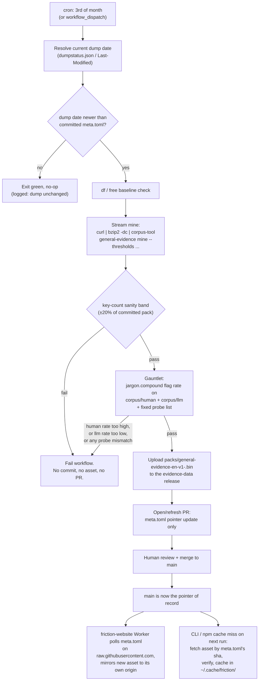

# Keeping `general-evidence-v1` current: the refresh pipeline

This is the CI design for `general-evidence-v1`, the web-scale evidence pack
`corpus-tool general-evidence` mines from the English Wikipedia dump. It
follows the same shape as `.github/workflows/attest-refresh.yml`
(`jargon-attest-v1`'s refresh) with two deliberate departures, both forced
by scale: the source dump is 26.7 GB compressed and the derived pack is
25-45 MB, so (1) mining must stream rather than stage, and (2) the pack
itself can never be a git blob — only its `meta.toml` sidecar is committed,
and the binary ships as a release asset instead. Read this with
`docs/WASM.md`, whose CORS findings this design leans on directly, and
`.github/workflows/attest-refresh.yml`, whose commit-gate-publish shape this
mirrors wherever the scale difference doesn't force a change.

## Status

Implemented today: the `friction_packs::general_evidence` pack module
(install seam + `FRICTION_GENERAL_EVIDENCE` / `~/.cache/friction/`
discovery), the `corpus-tool general-evidence {mine,pack}` subcommands,
and the `jargon.compound` channel they arm. Design-only, still to build
before the workflow below can run: the `general-evidence gauntlet`
subcommand (flag-rate bounds + probe list), the dump-provenance flags the
YAML passes to `mine`/`pack` (`--dump-date`, `--dump-sha256-file`, the
rate-bound env plumbing), and the workflow file itself. The YAML is the
target shape, not a transcript — reconcile flags against
`corpus-tool general-evidence --help` when building it. Note `mine` and
`pack` are two steps: `mine` streams stdin into `--work` partials;
`pack` merges, thresholds (`--min-count`), writes `--out` (refused inside
the repo tree without `--force-repo-out`) and the committed
`--meta-out` sidecar with caller-supplied `--source-label`/`--built-at`.

## Why this can't just be `attest-refresh.yml` again

`attest-refresh.yml` downloads a titles list and a topics list — tens of
megabytes total — builds a pack, and commits the result straight to `main`
with a version bump. Three things break that shape here:

1. **The source is 26.7 GB compressed, ~4 GB of usable page text is not the
   issue — the whole dump has to pass through the pipe.** Nothing that size
   can be `curl`'d to disk on a standard runner (`ubuntu-latest` has ~14 GB
   free) and nothing that size should be re-decompressed and re-read from
   disk if it doesn't have to be. It has to stream: `curl | bzip2 -dc |
   corpus-tool general-evidence mine`, counts accumulated in memory under
   the pack's own thresholds, nothing but the final pack ever touching
   disk in bulk.
2. **The pack itself (25-45 MB) still can't be a git blob**, even though
   `jargon-attest-en-v1.bin` (2.3 MB) is. Only `meta.toml` — thresholds,
   sha256, key counts, dump date — is committed; the binary is a GitHub
   release asset.
3. **A Wikipedia dump is not a curated, human-reviewed titles list.** Where
   `attest-refresh.yml` pushes straight to `main` on drift, this pipeline
   opens a PR instead: the diff a reviewer needs to see is `meta.toml`'s
   few lines (dump date, key counts, thresholds, sha256), not the binary,
   and provenance for a full-corpus-derived pack earns a second pair of
   eyes before it becomes what every `friction` install fetches.

Everything else — fail-closed on any gate, no commit/no release on a clean
or failing run, monthly cron plus `workflow_dispatch`, drift detection
before doing the expensive part — carries over unchanged.

## Monthly flow



A failed gate (`X`) leaves `main`, the release, and every downstream
consumer exactly where they were before the run started — the previous
`meta.toml` stays authoritative and nothing repointed at a regressing pack.

## Feasibility: does streaming mining fit in 6 hours?

Rough budget, stated as an estimate to validate empirically on the first
`workflow_dispatch` dry run, not a measured number:

| stage | estimate | basis |
|---|---|---|
| checkout, toolchain, cache restore | 2-4 min | same as every other workflow in this repo |
| dump-changed check (HEAD/dumpstatus.json) | <1 min | one small HTTP request |
| stream mine (`curl \| bzip2 -dc \| corpus-tool general-evidence mine`) | 45-100 min | dominant cost, see below |
| key-count sanity band, pack finalize | 1-3 min | in-process, no I/O of consequence |
| gauntlet (`corpus/human` + `corpus/llm`, both small, committed corpora) | 1-5 min | corpus is tens of MB, not GBs |
| release upload + PR open | 1-2 min | one `.bin` upload, one small PR |
| **total** | **~1-2 h realistic, comfortably under 6 h even at 2-3x this** | |

The stream-mine stage is bounded by whichever pipeline stage is slowest,
not their sum, because `curl`, `bzip2 -dc`, and the miner run concurrently
across the pipe: `bzip2 -dc`'s single-threaded decompression throughput on
GitHub-hosted runner CPUs is the realistic bottleneck (bzip2 is CPU-bound
and does not thread by itself), not network bandwidth to Wikimedia's mirrors
or the Rust miner's own tokenize-and-count throughput, which comfortably
outpaces bzip2 decompression on the same core budget. At 26.7 GB compressed
input, even a conservative single-core decompression estimate leaves the
whole streaming stage under two hours, with the rest of the workflow adding
low single-digit minutes. **This comfortably fits inside the 6h job limit
with several hours of margin** — but it is an estimate, not a measurement,
and the first several runs should go through `workflow_dispatch` before the
`schedule` trigger is trusted to run unattended.

Disk is the constraint that matters least here precisely *because* nothing
is staged: the compressed dump is never written to disk, only piped, so the
runner's ~14 GB free budget only has to cover the Rust build (~1-2 GB), the
checked-out corpus, and the final 25-45 MB pack, comfortably inside the
"partials budget ~6-8 GB" ceiling with room to spare. `df -h` before and
after the stream-mine step (in the YAML below) turns this from an assumption
into a logged fact on every run, which is what tells you *when* to reach for
a fallback rather than guessing.

### Fallbacks, in the order to reach for them

1. **Self-hosted runner label.** Zero changes to `corpus-tool` — swap
   `runs-on: ubuntu-latest` for a self-hosted label with more disk, more
   RAM, and no 6h wall clock. The first lever to pull if a real run's
   timing or memory footprint turns out tighter than the estimate above,
   because it requires no new subcommand surface.
2. **Chunked multi-job design over the multistream index.** If self-hosted
   infrastructure isn't available or desired, `enwiki-latest-pages-articles-
   multistream.xml.bz2` is paired with a `multistream-index.txt.bz2` mapping
   byte offsets to independently-decompressible blocks. Partition the index
   into N roughly equal byte ranges, run one matrix job per shard doing
   `curl --range <start>-<end> | bzip2 -dc | corpus-tool general-evidence
   mine --emit-partial-counts shard-N.bin` (small, threshold-bounded partial
   count files, not raw text, uploaded as build artifacts), then a final
   job downloads every shard's partial counts and merges them
   (`corpus-tool general-evidence merge-and-pack`) before the gate and
   publish steps proceed unchanged. Bounds any one job's wall time to
   roughly `total / N` regardless of how large the dump grows, at the cost
   of the merge subcommand and the shard-partitioning script. Worth
   building only once the single-job estimate above is actually falsified.
3. **Monthly manual dispatch as an operational safety net.** Independent of
   which compute path is used: ship the `schedule` trigger from day one per
   the constraint, but treat the first 2-3 cycles as `workflow_dispatch`-
   only in practice — watch them land, then trust the cron. This is a
   rollout posture, not a code change.

## Quality gate: never publish a regressing pack

The gate lives inside the refresh workflow, after mining and before
anything is uploaded or opened as a PR. It uses `corpus/human` and
`corpus/llm` — both already committed in-repo — plus a fixed probe list,
and it is fail-closed: any of the three checks failing stops the run before
the pack asset is uploaded or the PR is opened.

**1. Flag-rate bounds on `jargon.compound`.** Run `friction check` (or a
lighter `corpus-tool` stats path) over every file in `corpus/human/**` and
`corpus/llm/**`, count spans on the `jargon.compound` channel, normalize to
flags per 100k words per corpus.

- **Human ceiling**: the feasibility measurement's baseline is 1016/100k
  unattested on `corpus/human` *without* this pack — i.e., today's jargon
  channel over-flags ordinary human compounds because it has no web-scale
  evidence to attest them against. `general-evidence-v1`'s whole purpose is
  to pull that down into the tens/100k range. Recommend a starting ceiling
  of **≤ 50/100k** — a >20x reduction from baseline, generous enough that a
  correctly-mined pack passes comfortably, tight enough that a badly
  thresholded or truncated mine (e.g. a shard-merge bug swallowing half the
  vocabulary) gets caught immediately.
- **Machine floor**: the pack attesting more legitimate compounds must not
  also swallow genuine invented jargon in `corpus/llm`. Recommend **≥
  150/100k** — at minimum 3x the human ceiling, so the two bounds can never
  be satisfied by a pack that's simply attesting everything indiscriminately
  (which would push both rates toward zero, not just the human one).

Both numbers are workflow env vars (`HUMAN_CEILING_PER_100K`,
`LLM_FLOOR_PER_100K`), not hardcoded — tune them once the first real mined
pack's actual numbers are in hand; the ratio-based floor construction
(floor ≥ 3x ceiling) is the part worth keeping fixed.

**2. Fixed probe list, exact match, zero tolerance.** Unlike the rate
bounds, this is a deterministic assert, the same shape as `corpus-tool
holdout-check`: a small fixture of sentences, each with a required verdict.

- **Must flag** (`jargon.compound` span present): *semantic ladder*,
  *semantic carbonization*, *ephemeral quanta*, *dependency jungle*.
- **Must pass** (no `jargon.compound` span): *semantic versioning*,
  *classroom teacher*, *small city*.

A single mismatch on either list fails the workflow outright — there is no
partial credit here the way there is on the rate bounds, because these are
specific, previously-verified compounds chosen to sit exactly on the
attested/invented boundary; drift on any one of them is a direct signal the
mine or the threshold changed in a way that matters.

**3. Key-count sanity band**, same ±20%-of-previous check
`attest-refresh.yml` already runs on `jargon-attest-v1`, applied to
`general-evidence-v1`'s own key count in the freshly built `meta.toml`
against the committed one.

## `meta.toml`: the pointer, and the only thing committed

Lives at `crates/friction-packs/packs/general-evidence-en-v1.meta.toml`, same
directory convention as `jargon-attest-en-v1.toml`. The `.bin` it describes
is `.gitignore`'d — generated locally by every mine, never staged, never
committed.

```toml
schema_version = 1
dump_date = "2026-08-01"           # from dumpstatus.json's run date
dump_last_modified = "Sat, 01 Aug 2026 12:03:41 GMT"  # HTTP Last-Modified, fallback signal
dump_source_url = "https://dumps.wikimedia.org/enwiki/20260801/enwiki-20260801-pages-articles-multistream.xml.bz2"
dump_sha256 = "…"                  # sha256 of the compressed stream, computed via tee during mining
key_count = 2183441
human_ceiling_per_100k = 50
llm_floor_per_100k = 150
pack_sha256 = "…"
pack_size_bytes = 41893201
asset_filename = "general-evidence-en-v1-2026-08-01.bin"
release_tag = "evidence-data"
generated_at = "2026-08-01T14:22:09Z"
```

Every consumer (native CLI, npm postinstall, `friction-website`) resolves
the current pack by reading this file off `main` and following
`asset_filename` to the named asset on the `evidence-data` release —
`meta.toml` is the single source of truth for "what's current", never a
release's own "latest" semantics.

## Publishing: one rolling release, uniquely named assets

**Option A — versioned data releases** (`evidence-v2026-08`, a new tag and
release every cycle): simplest mental model, GitHub's own release history
*is* the changelog, but scatters the pack across dozens of releases over a
few years, and gives every consumer a moving target — "the latest data
release" isn't a stable URL, it's a query against the releases API.

**Option B — one rolling release** (`evidence-data`, same tag every cycle):
a single stable page and tag consumers can hardcode, but naive "upload with
`--clobber`" replaces the previous asset's bytes outright, which breaks the
rollback requirement — a reverted `meta.toml` would point at a filename
that no longer exists.

**Recommendation: rolling release, uniquely named assets.** One release,
tag `evidence-data`, updated in place — but each cycle's asset gets a
dump-date-qualified filename (`general-evidence-en-v1-2026-08-01.bin`) and
is *never* deleted or overwritten. The release page accumulates one asset
per successful cycle (25-45 MB each; even five years of monthly cycles is
under 2.5 GB total, trivial to keep indefinitely), and `meta.toml` on `main`
is what actually says which one is current. This gets Option A's rollback
safety (every past pack stays downloadable forever, by construction, not by
a retention policy someone has to remember) with Option B's stable
tag/release identity that every consumer and the website Worker can
hardcode. A retention/pruning policy (keep last N) is easy to add later if
the asset count ever becomes a real concern, not needed for v1 given the
size math above.

## Consumption

**Native CLI.** The pack can't be `include_bytes!`'d the way
`jargon-attest-en-v1.bin` is — it's never committed, so it's never present
at compile time. It needs the same install-seam shape `friction-nlp`'s
`weights_install.rs` and `friction-packs`'s `registry.rs` already use for
the tagger/parser/DMS index (`OverrideSlot`/`OnceLock`, checked-before-leak,
panic-naming-the-missing-install on first real use with nothing installed)
— a new `install_general_evidence_bytes(bytes: Vec<u8>)` seam, plus a
compiled-in copy of `meta.toml` (small, `include_str!`-able, it *is*
committed) so the binary always knows the current pointer as of its own
build. Unlike the wasm crate's install calls, which are mandatory before
`fix`/`check`/`explain` run at all, this channel's fetch should be
soft-optional: on first use, check `~/.cache/friction/general-evidence-en-
v1-<sha8>.bin`, fetch-and-verify against `meta.toml`'s `pack_sha256` if
missing, and degrade to "jargon.compound unavailable" rather than hard-
failing if the network isn't there — this is a convenience corpus, not a
correctness-critical one the way the tagger weights are.
`FRICTION_GENERAL_EVIDENCE_PATH` (env var) and a `--general-evidence-path`
flag should also exist, both for offline/airgapped users following the
documented manual-curl path (`curl -L <asset-url> -o
~/.cache/friction/general-evidence-en-v1.bin`) and for the refresh
workflow's own gauntlet step, which points a local `cargo run -p friction-
cli` straight at the just-mined `.bin` without a fetch round-trip.

**npm.** `npm/build.mjs` and the platform-package wrapper already don't
embed weights or packs in the npm tarball — they resolve a platform binary.
A `postinstall` hook can proactively warm `~/.cache/friction/` the same way
the CLI's own lazy fetch does, sparing first-run latency, but it must be a
soft-fail: `npm install` frequently runs in CI, offline, or firewalled
environments, and a missing network there should never fail the install.

**Release pipeline.** `release.yml` stays untouched with respect to this
pack — it is deliberately not one of the `friction-data-*` assets its
"Stage data artifacts" step re-uploads per version release, because doing
so would duplicate 25-45 MB onto every version release forever for data
that refreshes on its own monthly cadence, independent of the CLI's own
version bumps. The version release's compiled binary simply carries the
`meta.toml` pointer valid as of its build; the pack bytes are fetched
lazily, once, from the `evidence-data` release regardless of which CLI
version is asking.

**`friction-website` (Cloudflare).** This is where the design has to
diverge from `docs/WASM.md`'s existing pattern, not just extend it.
`raw.githubusercontent.com` is the current playground's answer to CORS
because the tagger/parser/DMS artifacts it fetches *are* committed to the
repo — `raw.githubusercontent.com` serves committed file bytes, full stop.
`general-evidence-en-v1.bin` is deliberately never committed, so
`raw.githubusercontent.com` has nothing to serve for it, and a GitHub
release-asset URL sends no `access-control-allow-origin` header at all
(same fact `docs/WASM.md` already establishes for the native binaries) —
a page on `friction-cli.dev` cannot `fetch()` it directly either way.

The fix is the origin-mirror `docs/WASM.md` gestures at but doesn't need
for the three artifacts it documents: a Cloudflare Worker (Cron Trigger, or
checked lazily per-request) fetches `meta.toml` from
`raw.githubusercontent.com` — that file *is* committed, so this leg is
already CORS-clean and needs no mirroring — reads `asset_filename` and
`pack_sha256`, and if its own cached copy's sha differs, does a *server-
side* fetch of the release-asset URL (CORS only constrains a browser's own
cross-origin fetch; a Worker-to-GitHub request is unaffected by the missing
header) and stores the bytes in Cache API/R2, then serves it back to
browsers from `friction-cli.dev`'s own origin. The URL path or an ETag
embeds the sha8 from `meta.toml` (`/data/general-evidence-en-v1-
<sha8>.bin`, `Cache-Control: immutable`), so cache-busting on refresh is
free — a new sha is a new URL, no explicit invalidation call needed, and a
stale in-flight request never serves mismatched bytes. This also decouples
the two repos entirely: the website polls `meta.toml` on its own schedule
and self-updates whenever main's pointer changes; the refresh workflow
never needs to know `friction-website` exists, push-notify it, or hold a
cross-repo token. A `repository_dispatch` call at the end of the PR-merge
step is a reasonable latency optimization later if same-day freshness ever
matters, but nothing about correctness depends on it given the monthly
cadence.

## The refresh workflow

`.github/workflows/refresh-evidence.yml`:

```yaml
name: Refresh general evidence

# Monthly rebuild of general-evidence-v1 from the current enwiki dump.
# Fail-closed by construction, same as attest-refresh.yml: an implausible
# key-count delta, a gauntlet regression, or any workspace test failure
# stops the run before anything is uploaded or opened as a PR. A run
# against an unchanged dump ends green with no work done.
#
# Diverges from attest-refresh.yml in one way on purpose: this opens a PR
# instead of pushing straight to main. The source here is a full dump
# mine, not a curated titles list, and the pack itself never enters the
# diff (only meta.toml does) — small enough, and consequential enough,
# to want a human glance before it becomes what every install fetches.

on:
  schedule:
    - cron: "40 5 3 * *"   # 3rd of each month, off attest-refresh's own window
  workflow_dispatch:

env:
  CARGO_TERM_COLOR: always
  HUMAN_CEILING_PER_100K: "50"
  LLM_FLOOR_PER_100K: "150"

permissions:
  contents: write
  pull-requests: write

jobs:
  refresh:
    runs-on: ubuntu-latest
    timeout-minutes: 300   # 5h soft ceiling, under the 6h hard job limit
    steps:
      - uses: actions/checkout@v4

      - uses: dtolnay/rust-toolchain@stable
      - uses: Swatinem/rust-cache@v2

      - name: Resolve current dump date
        id: dump
        run: |
          set -euo pipefail
          status=$(curl -fsSL --retry 3 "https://dumps.wikimedia.org/enwiki/latest/dumpstatus.json")
          date=$(echo "$status" | python3 -c "import json,sys; print(json.load(sys.stdin)['jobs']['articlesmultistreamdump']['updated'][:10].replace('-',''))")
          url=$(echo "$status" | python3 -c "
          import json, sys
          d = json.load(sys.stdin)
          files = d['jobs']['articlesmultistreamdump']['files']
          name = next(f for f in files if f.endswith('-pages-articles-multistream.xml.bz2'))
          print('https://dumps.wikimedia.org' + d['jobs']['articlesmultistreamdump']['files'][name]['url'])
          ")
          lm=$(curl -fsSI --retry 3 "$url" | grep -i '^last-modified:' | cut -d' ' -f2- | tr -d '\r')
          echo "date=$date" >> "$GITHUB_OUTPUT"
          echo "url=$url" >> "$GITHUB_OUTPUT"
          echo "last_modified=$lm" >> "$GITHUB_OUTPUT"
          echo "resolved dump $date at $url ($lm)"

      - name: Check for drift against committed meta.toml
        id: drift
        run: |
          set -euo pipefail
          recorded=$(grep -m1 '^dump_date' crates/friction-packs/packs/general-evidence-en-v1.meta.toml | cut -d'"' -f2)
          if [ "$recorded" = "${{ steps.dump.outputs.date }}" ]; then
            echo "changed=false" >> "$GITHUB_OUTPUT"
            echo "dump unchanged since $recorded; nothing to do"
          else
            echo "changed=true" >> "$GITHUB_OUTPUT"
            echo "dump moved: $recorded -> ${{ steps.dump.outputs.date }}"
          fi

      - name: Disk baseline
        if: steps.drift.outputs.changed == 'true'
        run: df -h /

      - name: Stream mine
        if: steps.drift.outputs.changed == 'true'
        run: |
          set -euo pipefail
          cargo build --release -p corpus-tool
          curl -fsSL --retry 3 "${{ steps.dump.outputs.url }}" \
            | tee >(sha256sum | cut -d' ' -f1 > /tmp/dump.sha256) \
            | bzip2 -dc \
            | ./target/release/corpus-tool general-evidence mine \
                --work /tmp/evidence-work
          ./target/release/corpus-tool general-evidence pack \
            --work /tmp/evidence-work \
            --min-count 5 \
            --out /tmp/general-evidence-en-v1.bin \
            --meta-out crates/friction-packs/packs/general-evidence-en-v1.meta.toml \
            --source-label "enwiki-${{ steps.dump.outputs.date }}-pages-articles" \
            --built-at "${{ steps.dump.outputs.last_modified }}"
          # (planned) dump provenance flags on pack — --dump-sha256-file
          # /tmp/dump.sha256, --dump-source-url — once implemented

      - name: Disk after mining
        if: steps.drift.outputs.changed == 'true'
        run: df -h /

      - name: Key-count sanity band
        if: steps.drift.outputs.changed == 'true'
        run: |
          set -euo pipefail
          old=$(git show HEAD:crates/friction-packs/packs/general-evidence-en-v1.meta.toml | grep -m1 '^key_count' | grep -o '[0-9]*')
          new=$(grep -m1 '^key_count' crates/friction-packs/packs/general-evidence-en-v1.meta.toml | grep -o '[0-9]*')
          echo "key_count: $old -> $new"
          python3 -c "import sys; o, n = int('$old'), int('$new'); sys.exit(0 if 0.8 * o <= n <= 1.2 * o else 1)"

      - name: Gauntlet — flag-rate bounds and probe list
        if: steps.drift.outputs.changed == 'true'
        env:
          FRICTION_GENERAL_EVIDENCE_PATH: crates/friction-packs/packs/general-evidence-en-v1.bin
        run: cargo run --release -p corpus-tool -- general-evidence gauntlet corpus/human corpus/llm

      - name: Bump asset filename, stage release notes
        if: steps.drift.outputs.changed == 'true'
        id: asset
        run: |
          name="general-evidence-en-v1-${{ steps.dump.outputs.date }}.bin"
          cp crates/friction-packs/packs/general-evidence-en-v1.bin "/tmp/$name"
          echo "name=$name" >> "$GITHUB_OUTPUT"

      - name: Publish pack asset
        if: steps.drift.outputs.changed == 'true'
        env:
          GH_TOKEN: ${{ github.token }}
        run: |
          gh release view evidence-data >/dev/null 2>&1 || \
            gh release create evidence-data --title "General evidence (rolling)" \
              --notes "Rolling release for general-evidence-v1. meta.toml on main names the current asset; every past asset stays downloadable for rollback."
          gh release upload evidence-data "/tmp/${{ steps.asset.outputs.name }}"

      - name: Open PR updating meta.toml
        if: steps.drift.outputs.changed == 'true'
        uses: peter-evans/create-pull-request@v6
        with:
          add-paths: crates/friction-packs/packs/general-evidence-en-v1.meta.toml
          commit-message: "general-evidence-v1: refresh to dump ${{ steps.dump.outputs.date }}"
          title: "general-evidence-v1: refresh to dump ${{ steps.dump.outputs.date }}"
          body: |
            Unattended monthly mine from the enwiki dump dated
            ${{ steps.dump.outputs.date }}. The mined pack passed the
            key-count sanity band and the gauntlet (jargon.compound flag
            rate on corpus/human and corpus/llm, plus the fixed probe
            list) before this PR was opened.

            The pack binary is `${{ steps.asset.outputs.name }}` on the
            `evidence-data` release, not part of this diff — only
            `meta.toml`'s pointer changes.
          branch: general-evidence-refresh
          delete-branch: true
```

`peter-evans/create-pull-request` over a hand-rolled `gh pr create`: it
reuses `branch: general-evidence-refresh` across cycles, so a second
monthly run before the first PR merges updates the existing PR instead of
piling up duplicates, and it no-ops cleanly (opens nothing) when there's no
diff to propose — which can happen here if the mine and gate both pass but
somehow reproduce byte-identical `meta.toml` content, an edge case worth
having handled for free rather than scripted by hand.

## Rollback

Every past cycle's asset stays on the `evidence-data` release forever, by
construction of the "never delete, never clobber" publishing rule above —
there is no separate rollback machinery to build. Reverting is: revert (or
hand-edit) the `meta.toml`-updating commit on `main` back to a previous
`asset_filename`/`pack_sha256`/`dump_date`, open that as an ordinary PR,
merge it. Every consumer re-resolves from `meta.toml` on its own next
touch — the native CLI's cache-miss path fetches the (still-present) older
asset by its filename and verifies against the reverted sha, `npm`'s
postinstall does the same, and `friction-website`'s Worker either already
has the older sha cached (near-instant) or re-mirrors it server-side (one
more small fetch, still no browser-side CORS concern). No re-mining, no
re-tagging, no asset deletion — the rollback is exactly as small as the
`meta.toml` diff that caused the problem.